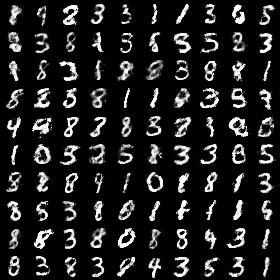
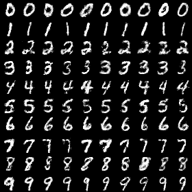
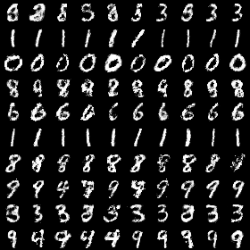
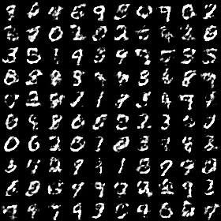

# Multiple-GAN-Tensorflow-Mnist

## Introduction
Those code implement multiple gan including vanilla_gan, dcgan, cgan, infogan and wgan.
I only use mnist dataset and if I have enough time later, I will update other dataset.

## How to run the code
### Vanilla_gan
Paper: [Generative Adversarial Nets](https://arxiv.org/pdf/1406.2661.pdf)
```
pip3 train.py vanilla_gan mnist
```
### Dcgan
Paper: [Unsupervised Representation Learning with Deep Convolutional Generative Adversarial Networks](https://arxiv.org/pdf/1511.06434.pdf)
```
pip3 train.py dcgan mnist
```
### Cgan
Paper: [Conditional Generative Adversarial Nets](https://arxiv.org/pdf/1411.1784.pdf)
```
pip3 train.py cgan mnist
```

### Infogan
Paper: [InfoGAN: Interpretable Representation Learning by Information Maximizing Generative Adversarial Nets](https://arxiv.org/pdf/1606.03657.pdf)
```
pip3 train.py infogan mnist
```
### Wgan
Paper: [Wasserstein GAN](https://arxiv.org/pdf/1701.07875.pdf)
```
pip3 train.py wgan mnist
```
## Result
### vanilla_gan
 

### dcgan
 

### cgan
 

### infogan
 

### wgan
 